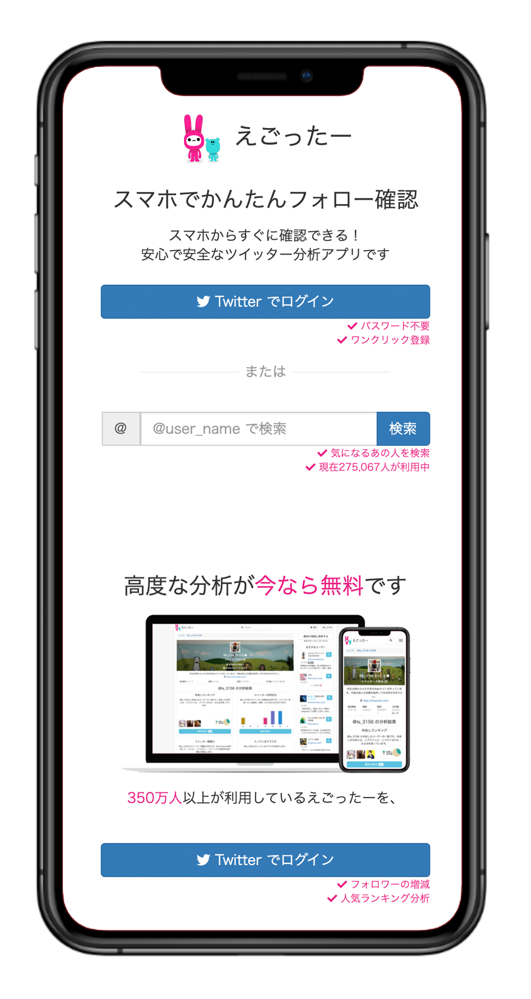
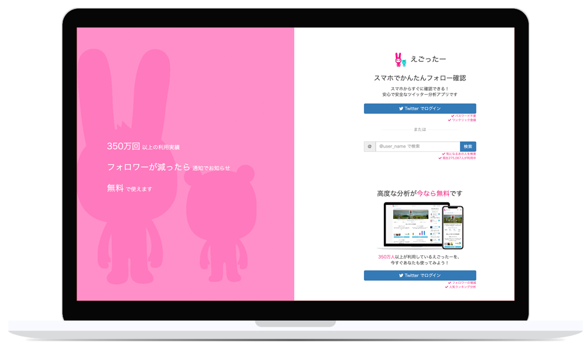

# egotter

 

<table>
    <tr>
        <td></td>
        <td></td>
    </tr>
</table>

## Design

### Controller

- HomeController
- SearchesController
- TimelinesController

# Model

- User
- TwitterUser

# Worker

- CreateTwitterUserWorker

# Request

- CreateTwitterUserRequest

## License

Egotter is released under the [MIT License](http://www.opensource.org/licenses/MIT).
