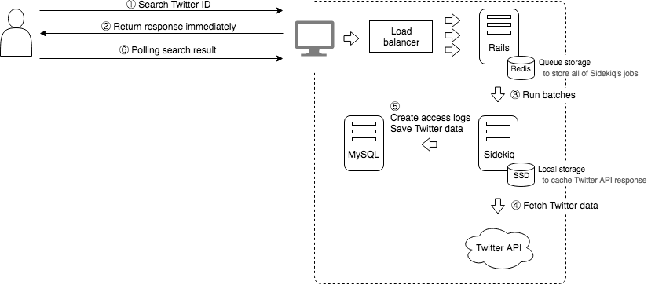

# egotter

[](https://travis-ci.org/ts-3156/egotter) [](https://codeclimate.com/github/egotter/egotter/test_coverage) [](https://codeclimate.com/github/egotter/egotter/maintainability)

Please enjoy egotter!  ✧*｡٩(ˊᗜˋ*)و✧*｡

## Screenshots

### Desktop

<table>
    <tr>
        <td>Top page</td>
        <td>Result page</td>
    </tr>
    <tr>
        <td></td>
        <td></td>
    </tr>
</table>

### Mobile

<table>
    <tr>
        <td>Top page</td>
        <td>Result page</td>
    </tr>
    <tr>
        <td></td>
        <td></td>
    </tr>
</table>

## Architecture



## Design

### HomeController#new

Display a top page.

In routes.rb:

```ruby
root 'home#new'
```

### SearchesController#create

Create a new search result.

If search results which someone created before exists,
the user will be redirected to `TimelinesController#show` to see existing data.
On this page the browser will periodically check new search result with ajax polling.

If any search results don't exist, the user will be redirected to
`SearchesController#waiting` and the browser will periodically check first search result.

### WaitingController#new

### TimelinesController#show

## Server Components

### Nginx

[/etc/nginx/nginx.conf](setup/etc/nginx/nginx.conf)

### MySQL on RDS
### Rails
### Unicorn

[config/unicorn.rb](config/unicorn.rb)

[/etc/init.d/unicorn](setup/etc/init.d/unicorn)

### Redis

[/etc/redis.conf](setup/etc/redis.conf)

[config/initializers/redis.rb](config/initializers/redis.rb)

### Sidekiq

[/etc/init.d/sidekiq_base](setup/etc/init.d/sidekiq_base)

[/etc/init.d/sidekiq](setup/etc/init.d/sidekiq)

[config/initializers/sidekiq.rb](config/initializers/sidekiq.rb)

### td-agent

[/etc/td-agent/td-agent.conf.web](setup/etc/td-agent/td-agent.conf.web)

[/etc/td-agent/td-agent.conf.sidekiq](setup/etc/td-agent/td-agent.conf.sidekiq)

### Monit

[/etc/monit.conf](setup/etc/monit.conf)

## Setup

Read `setup/install_egotter.sh`

```bash
/etc/init.d/egotter start
```

## License

Egotter is released under the [MIT License](http://www.opensource.org/licenses/MIT).
